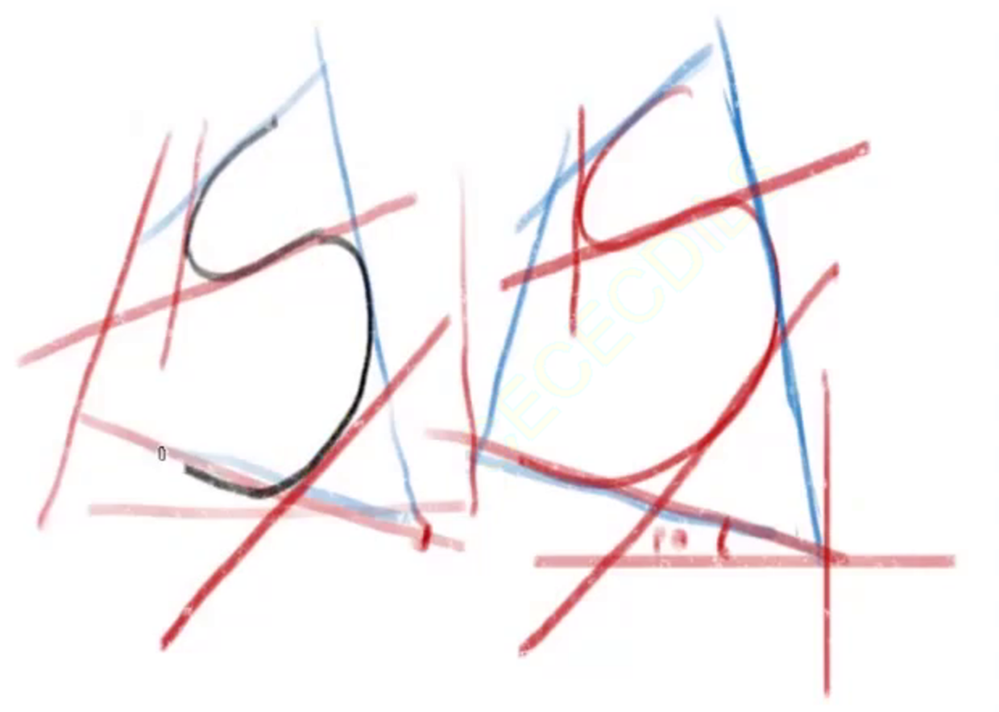
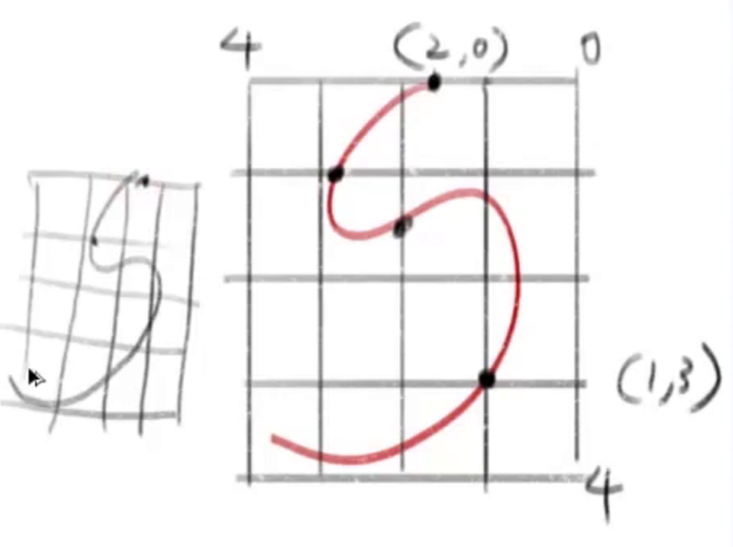
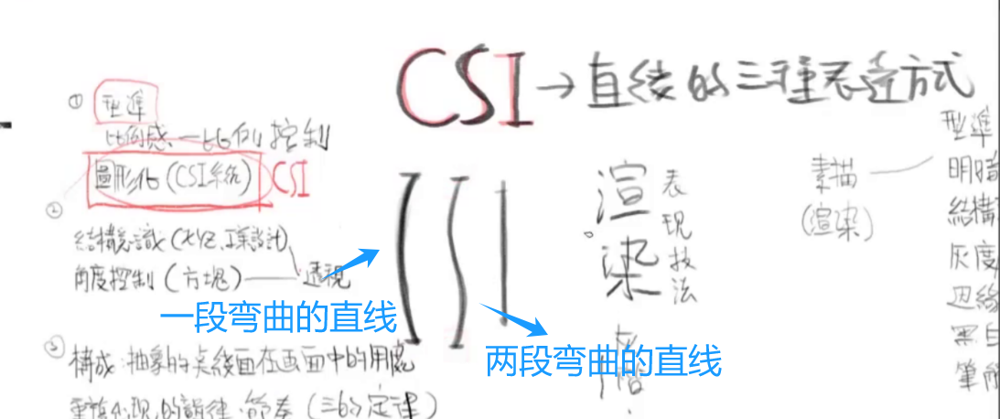

# 绘画地图
## 一、建模与造型能力 
### 型准（眼手和一）（建模造型能力基础）
练习型准 比例感  
1) 临摹  
有效临摹：不是临摹结果，而是推理步骤，按步骤还原。
2) 辅助线，通过斜率找型准 （观察、连线、切块）  

3) 九宫格
     

透视的作用：
如果在没有透视的临摹中，只有靠观察去画每一根线。如果有透视理论，那么可以根据透视推理出一些线条，节省观察时间  
在保证大部分型准对的情况下，用透视来推理，如果临摹对象有不对的地方，用透视修正。

### CSI 直线的三种表达方式（画CSI线要一笔到位）
  
用富有弹性有点弯曲的线（C）去连接一些点，用来画出一些曲线